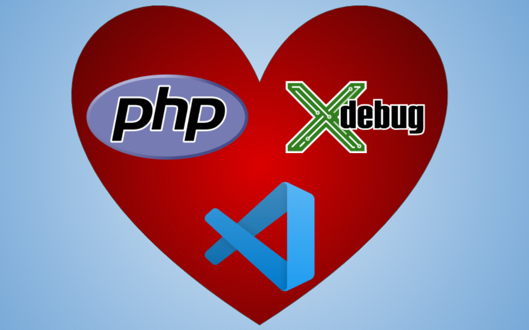
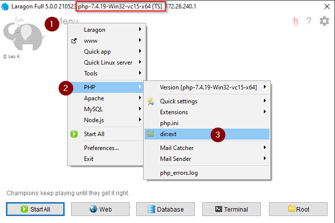
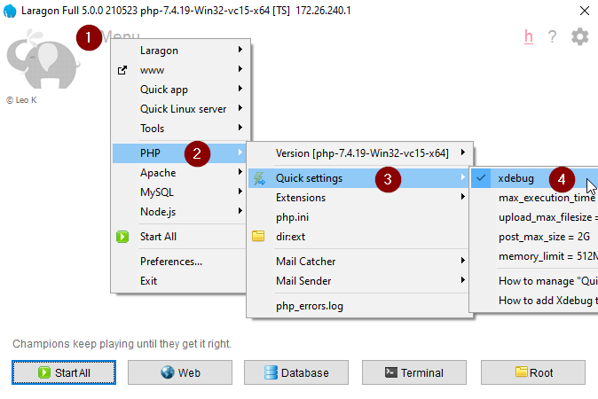
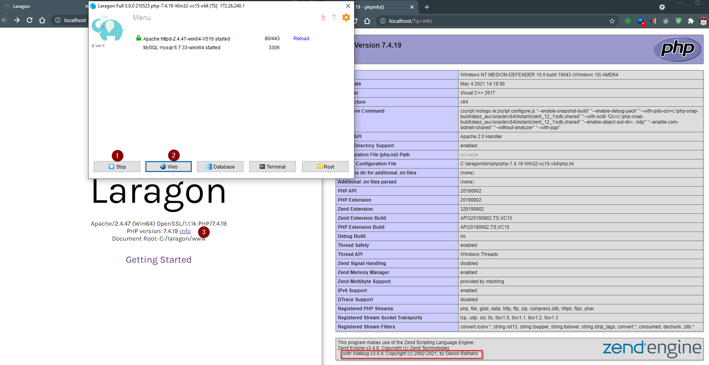
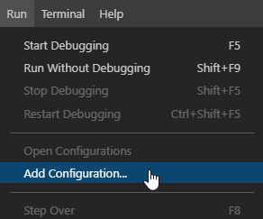
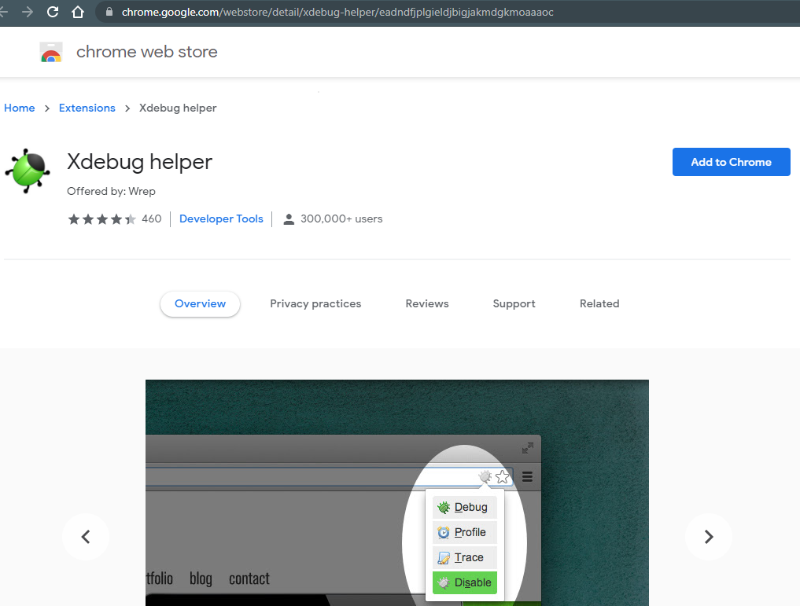
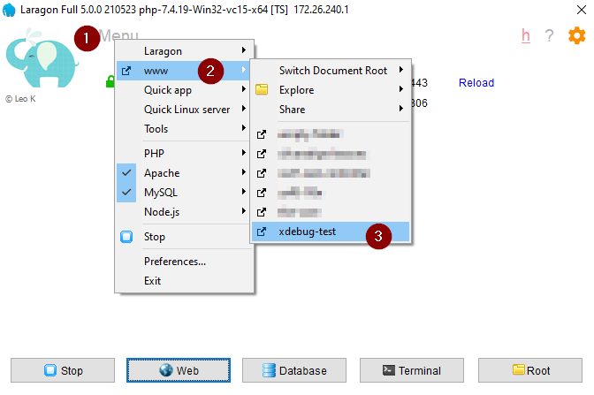
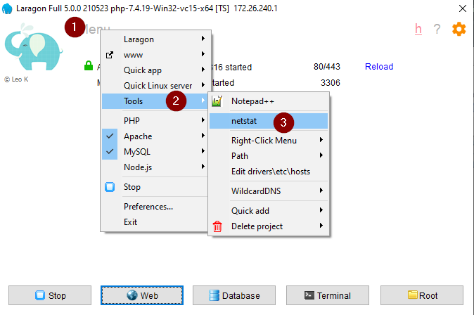
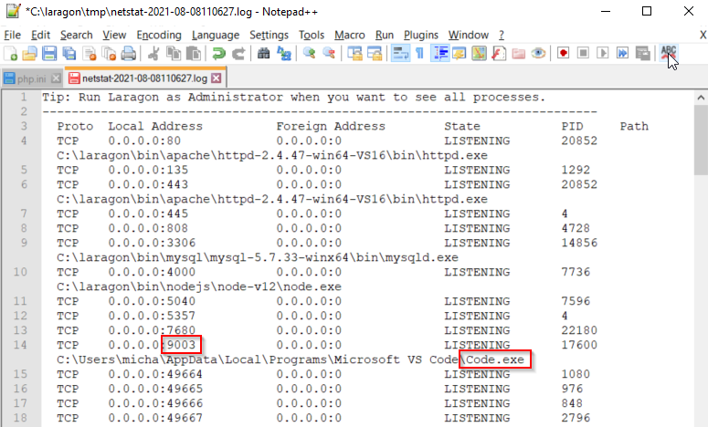

This is my method to set up [VS Code](https://code.visualstudio.com/) to use PHP with [Xdebug](https://xdebug.org/docs/) on Windows using [Laragon](https://laragon.org/).

## Install Laragon for Windows

> Laragon is a portable, isolated, fast & powerful universal development environment for PHP, Node.js, Python, Java, Go, Ruby. It is fast, lightweight, easy-to-use and easy-to-extend.
> Laragon is great for building and managing modern web applications. It is focused on performance - designed around stability, simplicity, flexibility and freedom.

[Download and Install](https://laragon.org/docs/install.html), the **Laragon Full (64-bit)** version. Run the installation, next>, next>, next>. You now have a fully working WAMP stack, plus Node/NPM, git, Composer and many more tools.

Once installed **Add Laragon to Path**: Menu > Tools > Path > Add Laragon to Path


You then need to **Sign out** and back **in** for the path to be added to your user profile for all terminals and programs (CMD / PowerShell / Terminal / VS Code etc.)

## Add Xdebug to PHP

Xdebug can be downloaded from [xdebug.org](https://xdebug.org/download), there are currently 16 versions to choose!

PHP has 4 versions, from PHP 7.2 to PHP 8.0, each version can be 32-bit (x86) or 64-bit (x64), Thread Safe (TS) or Non Thread Safe (NTS). For Laragon v5 you would use 64 bit. Apache requires the Thread Safe (TS) version, Internet Information Services (IIS) requires the Non-Thread Safe version (NTS). The version of Xdebug needs to match the version of PHP. Look at the version installed to match the version required.


- Laragon ships with: **php-7.4**.19-Win32-vc15-**x64** **\[TS\]** -> download **PHP 7.4 VC15 TS 64 bit**
- If you install:  **php-8.0**.8-Win32-vs16-**x64** **\[TS\]** -> download **PHP 8.0 VS16 TS 64 bit**

Once the correct **dll** is downloaded (e.g. ) copy it from your **download folder** to the **php ext folder**. Tip: Use Laragon to open this folder using: Menu > PHP > dir:ext



Back in Laragon enable the Xdebug extension:

Menu > PHP > Quick settings > ☑ xdebug



Next add Xdebug configuration to **php.ini**

Laragon Menu > PHP > php.ini

Wait for **php.ini** to open with Notepad++, scroll to the bottom of the file and add:

```ini
[xdebug]
xdebug.mode = coverage,debug,develop
```

Save and close the php.ini file.

This is the minimum required for debugging and code coverage, Xdebug default setting for xdebug.client_port is now **9003** and xdebug.client_host **localhost**, these no longer need to be specified in the php.ini.

## Check Xdebug using Laragon Web

1. Click the start button (it changes to Stop when running)
2. Click Web
3. Check the information on the Laragon webpage and next to the PHP version click info

The **phpinfo()** page will display, check Xdebug is displayed



Scroll down and see the section on Xdebug, check coverage, debug and develop features are ticked.


## Install VS Code

> Code editing. Redefined. Free. Built on open source. Runs everywhere.

[Download for Windows](https://code.visualstudio.com/)

The installer is straightforward, run, next, next finish.

### Add Xdebug extension for VS Code

Open VS Code and install the extension: Press **F1**, press Backspace to delete the **>** and type `ext install php-debug`


There are several extensions with the same name, install the one with 5M downloads.

### Configure VS Code

Next VS Code needs to have a launch script created, select **Run** from the menu and click **Add Configuration...**



This will auto generate a **launch.json** file. If you are prompted for a language select **PHP**. The file can be closed.

## Run test code from CLI

Create a basic script to test the setup. Create a directory in the Laragon www directory, i.e. C:\laragon\www\ **xdebug-test**, call the file **example.php**

```php
<?php 
$message = "<h1>Hello, world</h1>";
$xdebugBreak = xdebug_break();
echo $message;
?>
```

1. Click the Run and Debug menu
2. Change the drop-down options to **Launch currently open script**
3. Click the Run icon


Notice although no debug point was created the script has triggered debugging after the `xdebug_break()` line. You can also see the local variables.

The `xdebug_break()` function is useful when setting up Xdebug, if Xdebug isn't loaded an exception will be thrown instead! If you get this error re-check Xdebug has been enabled and the **php.ini** has **xdebug.mode** line as above. It is also possible to set a different version of PHP to run from the command line. See troubleshooting below.

```text
Fatal error: Uncaught Error: Call to undefined function xdebug_break() in 
C:\laragon\www\xdebug-test\index.php:3 Stack trace: #0 {main} thrown in 
C:\laragon\www\xdebug-test\example.php on line 3
```

## Install Xdebug helper on Chrome

For debugging on a web page a helper extension can be installed for Google Chrome browser (it is also available on other browsers).

- [Xdebug helper Offered by: Wrep](https://chrome.google.com/webstore/detail/xdebug-helper/eadndfjplgieldjbigjakmdgkmoaaaoc)



Click **Add to Chrome** (if you get a notification to add to Chrome click that too). Then find the grey xdebug helper icon in your list of icons (it maybe under the jigsaw icon), click it and select debug, I find it is useful to click the pin too, which will display the icon in the main icon it will turn green.

## Debug code in a browser

In VS Code:

- Click the Run and Debug menu
- Change the drop-down options to **Listen for Xdebug**
- Click the Run icon

The bar on the bottom of VS Code will display orange with the text **Listen for Xdebug (xdebug-test)**

Rename the file **index.php**

In Laragon:

1. Click Menu
2. Click www
3. Select the xdebug-test folder



Your web browser will launch, switch to VS Code and you will see the debug session has stopped as before.

If it doesn't automatically stop check the debug icon is green, if it is grey click it and select debug, then refresh the page.

The `xdebug_break()` function has now served its purpose, you can continue to use that function, however when the Xdebug is disabled the code will throw an exception. Delete the line with the Xdebug function, press F9 to toggle a breakpoint, a red dot will display to the right of the selected line.

If you are still debugging press F5 to continue. Refresh the webpage page and debugging will trigger at the breakpoint.

Refresh the webpage and the debugging will stop at the breakpoint.

### Debug actions

Once a debug session starts, the **Debug toolbar** will appear on the top of the editor.


- Continue / Pause `F5`
- Step Over `F10`
- Step Into `F11`
- Step Out `Shift+F11`
- Restart `Ctrl+Shift+F5`
- Stop `Shift+F5`

For more information on how to use debug see the links in Further information, which link to official documentation and official YouTube video. 

## Troubleshooting

### Port 9003 is in use

If there are any problems with port 9003 being used by another application run **netstat**

From Laragon:

1. Menu
2. Tools
3. netstat



Wait a few seconds and Notepad++ will open with the stats.



The important line is for port **9003**, this is required for Xdebug to work, this example is correct, I have set VS Code to listen for Xdebug. If another program is using this port then change the port Xdebug uses and VS Code listens on:

- **php.ini**, e.g. add the line for Xdebug to use port **9004**

```ini
[xdebug]
xdebug.mode = coverage,debug,develop
xdebug.client_port = 9004
```

- VS Code open **launch.json** (in the **.vscode** directory), change the two locations from **"port": 9003** to **"port": 9004**

```json
{
  "version": "0.2.0",
  "configurations": [
    {
      "name": "Listen for Xdebug",
      "type": "php",
      "request": "launch",
      "port": 9004
    },
    {
      "name": "Launch currently open script",
      "type": "php",
      "request": "launch",
      "program": "${file}",
      "cwd": "${fileDirname}",
      "port": 0,
      "runtimeArgs": [
        "-dxdebug.start_with_request=yes"
      ],
      "env": {
        "XDEBUG_MODE": "debug,develop",
        "XDEBUG_CONFIG": "client_port=${port}"
      }
    },
    {
      "name": "Launch Built-in web server",
      "type": "php",
      "request": "launch",
      "runtimeArgs": [
        "-dxdebug.mode=debug",
        "-dxdebug.start_with_request=yes",
        "-S",
        "localhost:0"
      ],
      "program": "",
      "cwd": "${workspaceRoot}",
      "port": 9004,
      "serverReadyAction": {
        "pattern": "Development Server \\(http://localhost:([0-9]+)\\) started",
        "uriFormat": "http://localhost:%s",
        "action": "openExternally"
      }
    }
  ]
}
```

In Laragon, next to Apache click **Reload**. Click **web** button and **info**, as previously, scroll down to Xdebug and look for **xdebug.client_port**:

| Directive	| Local Value |
| :--- | :--- |
| .... | .... |
| xdebug.client_port | 9004 |
| .... | .... |

Refresh the webpage created earlier and Xdebug will now work on port 9004.

Check the Xdebug helper icon is green, if it was grey click it and select Debug, wait for it to turn green and refresh the page once more.

### PHP CLI is different from the PHP used by Apache

Laragon makes is easy to switch versions of PHP, this can lead to the version used by Apache being different from the one used by VS Code or the command line.

```shell
php -v
```

```text
PHP 7.4.19 (cli) (built: May  4 2021 14:24:38) ( ZTS Visual C++ 2017 x64 )
Copyright (c) The PHP Group
Zend Engine v3.4.0, Copyright (c) Zend Technologies
    with Xdebug v3.0.4, Copyright (c) 2002-2021, by Derick Rethans
```

The output for PHP is slightly different, the important lines are **PHP 7.4.19** should be the same as used by Apache and **with Xdebug v3...**, if the PHP version is different see Add Laragon to all terminals below. If they are the same PHP version, but Xdebug doesn't display check the **php.ini** and Xdebug is enabled, see **Add Xdebug to PHP** above.

### Add Laragon to all terminals

Just click **Menu > Tools > PATH environment variable > Add Laragon to Path**


You then need to **Sign out** and back **in** for the path to be added to your user profile for all terminals and programs (CMD / PowerShell / Terminal / VS Code etc.)

One point to note: if you change PHP version, you need to run **Remove Laragon from Path**, log off and back on. Then **Add Laragon to Path** log off and back on to update the path set in user profile!

PHP and  all the other Laragon applications will then be available in all terminals and applications, including VS Code.

## Further information

- [Xdebug 3 — Documentation](https://xdebug.org/docs/) - full documentation for Xdebug 3
- [Youtube Xdebug 3 Documentation](https://www.youtube.com/playlist?list=PLg9Kjjye-m1g_eXpdaifUqLqALLqZqKd4) - by Derick Rethans - A series of videos to explain how Xdebug 3 and all of its features work.
- [Debugging in VS Code](https://code.visualstudio.com/docs/editor/debugging) - official VS Code documentation.
- [Laragon's forum](https://forum.laragon.org/) - useful forum for anything Laragon related, you may see some answers from me too 😃
